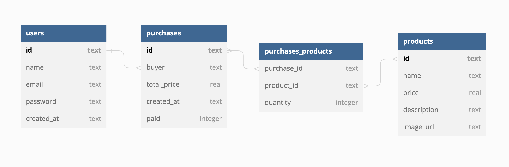

# **Projeto Labecommerce**

O projeto é um banco de dados com o intuito de acessar e modificar informações de usuários, produtos e compras. Esse projeto foi desenvolvido como parte do bootcamp Labenu.

## **Índice**
- <a href="#funcionalidades-do-projeto">Funcionalidades do projeto</a>
- <a href="#layout">Layout</a>
- <a href="#documentação">Documentação</a>
- <a href="#como-rodar-esse-projeto">Como rodar esse projeto?</a>
- <a href="#tecnologias-utilizadas">Tecnologias utilizadas</a>
- <a href="#pessoas-autoras">Pessoas autoras</a>

## **Funcionalidades do projeto**
- [x] Get all users
- [x] Create user
- [x] Delete user by id
- [x] Get all products
- [x] Get product by name
- [x] Edit product by id
- [x] Delete product by id
- [x] Create purchase
- [x] Get purchase by id
- [x] Delete purchase by id

## **Layout**



## Documentação
[Documentação no Postman](https://documenter.getpostman.com/view/24460792/2s8ZDeSyPY)

## **Como rodar esse projeto?**

```
# Clone esse repositório
$ git clone link-repositorio

# Acesse a pasta do projeto no seu terminal
$ cd projeto-labecommerce

# Instale as dependências
$ npm install 

# Execute a aplicação
$ npm run dev
```

## **Tecnologias utilizadas**
1. [Typescript](https://www.typescriptlang.org/)
2. [SQLite](https://www.sqlite.org/index.html)
3. [NodeJS](https://nodejs.org/)
4. [Express](https://expressjs.com/pt-br/)
5. [Knex](https://knexjs.org/)
6. [Postman](https://www.postman.com/)

## **Pessoas autoras**


[Linkedin](https://www.linkedin.com/in/mariaconstance/)